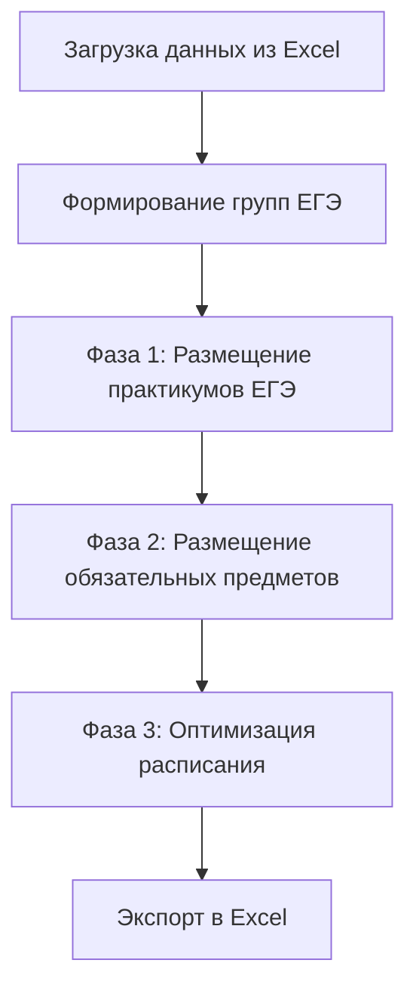

# 📚 Система автоматизации составления расписания

Автоматическая генерация расписания для московской школы "Покровский квартал" с учетом практикумов ЕГЭ и индивидуальных учебных планов.

## 🎯 Цель проекта

Создать программное обеспечение для автоматического составления расписания 11 классов во втором полугодии, когда ученики выбирают индивидуальные предметы для подготовки к ЕГЭ и формируются межклассовые группы.

## 📊 Текущий статус: 40% завершено

- ✅ **Структура данных** - 100%
- ✅ **Загрузка данных** - 100%
- ✅ **Размещение практикумов ЕГЭ** - 80%
- ⏳ **Размещение обязательных предметов** - 0%
- ⏳ **Оптимизация** - 0%
- ⏳ **Веб-интерфейс** - 0%

## 🏗️ Архитектура

### Модули

```
schedule_base.py          # Базовые классы: Teacher, Student, Class, Lesson, Schedule
data_loader.py           # Загрузка данных из Excel файлов
schedule_generator.py    # Алгоритмы генерации расписания
export_excel.py         # Экспорт результатов (TODO)
streamlit_app.py        # Веб-интерфейс (TODO)
```

### Алгоритм работы



## 📦 Установка

### Требования

- Python 3.10+
- pandas
- openpyxl
- streamlit (для веб-интерфейса)

### Установка зависимостей

```bash
pip install -r requirements.txt
```

## 🚀 Быстрый старт

### 1. Подготовка данных

Поместите в папку `data/`:
- `Здания__кабинеты__места__школьные_здания_.xlsx` - кабинеты
- `Расстановка_кадров_ФЕВРАЛЬ_2025-2026_учебный_год__2_.xlsx` - учителя и предметы
- `Список_участников_ГИА-11_ГБОУ_Школа__Покровский_квартал___41_.xlsx` - выбор ЕГЭ

### 2. Запуск генератора

```bash
python schedule_generator.py
```

Результат сохранится в `output/schedule_phase1.json`

### 3. Запуск веб-интерфейса (когда будет готов)

```bash
streamlit run streamlit_app.py
```

## 📖 Документация по модулям

### schedule_base.py

**Основные классы:**

#### `TimeSlot`
Представляет временной слот (день недели + номер урока)

```python
slot = TimeSlot(day=DayOfWeek.MONDAY, lesson_number=1)
```

#### `Teacher`
Учитель с информацией о предметах и доступности

```python
teacher = Teacher(
    name="Иванов И.И.",
    subjects=["Математика", "Физика"],
    home_classroom="42",
    unavailable_days={DayOfWeek.MONDAY}
)
```

#### `Student`
Ученик с выбором предметов ЕГЭ

```python
student = Student(
    name="Петров П.П.",
    class_name="11В",
    ege_subjects=["Математика профильная", "Физика"]
)
```

#### `Lesson`
Урок в расписании

```python
lesson = Lesson(
    subject="Математика",
    teacher=teacher,
    class_or_group="11В",
    classroom=classroom,
    time_slot=time_slot
)
```

#### `Schedule`
Полное расписание с методами проверки и анализа

```python
schedule = Schedule()
schedule.add_lesson(lesson)

# Проверки
schedule.is_teacher_busy(teacher, time_slot)
schedule.is_class_busy("11В", time_slot)

# Анализ
gaps = schedule.get_teacher_gaps(teacher)
```

### data_loader.py

**Класс `DataLoader`**

Загружает все данные из Excel файлов:

```python
loader = DataLoader()

# Загрузка данных
loader.load_classrooms('path/to/classrooms.xlsx')
loader.load_teachers_and_subjects('path/to/staff.xlsx')
loader.load_students_and_ege_choices('path/to/students.xlsx')
loader.create_ege_practice_groups()

# Доступ к данным
teachers = loader.teachers  # Dict[str, Teacher]
students = loader.students  # Dict[str, Student]
classes = loader.classes    # Dict[str, Class]
ege_groups = loader.ege_groups  # List[EGEPracticeGroup]
```

### schedule_generator.py

**Класс `ScheduleGenerator`**

Генерирует расписание в три фазы:

```python
generator = ScheduleGenerator(loader)

# Фаза 1: Практикумы ЕГЭ (реализовано)
generator.place_ege_practices()

# Фаза 2: Обязательные предметы (TODO)
generator.place_mandatory_subjects()

# Фаза 3: Оптимизация (TODO)
generator.optimize_schedule()

# Сохранение
generator.schedule.save_to_json('output/schedule.json')
```

## 🎓 Специфика школы

### Параметры

- **Классов:** 9 (11В, 11Д, 11Ж, 11Л, 11О, 11Р, 11С, 11Ф, 11Ю)
- **Учеников:** 256
- **Учителей:** 42
- **Кабинетов:** 29
- **Дней в неделю:** 5 (пн-пт)
- **Уроков в день:** до 7
- **Режим звонков:** 9:00-15:00

### Практикумы ЕГЭ

**15 предметов на выбор:**
- Русский язык (обязательно, 255 учеников)
- Математика базовая/профильная (256 учеников)
- Английский язык (144 ученика)
- Обществознание (137 учеников)
- История (50 учеников)
- Литература (73 ученика)
- И другие

**Особенности:**
- Все практикумы проходят одновременно для всех 11 классов
- Формируются межклассовые группы
- 3-4 часа в неделю на каждый предмет

### Приоритеты оптимизации

1. **Минимизация окон у учителей** (4/5) - самое важное
2. **Компактное расписание для классов** (4/5)
3. **Удобное время для сложных предметов** (4/5) - 2-4 урок
4. **Равномерная нагрузка по дням** (3/5)
5. **Минимизация переходов между кабинетами** (1/5) - наименее важное

## 🛠️ Разработка

### Структура папок

```
schedule_automation/
├── schedule_base.py
├── data_loader.py
├── schedule_generator.py
├── export_excel.py         # TODO
├── streamlit_app.py        # TODO
├── requirements.txt
├── README.md
├── PROMPT_FOR_CLAUDE_CODE.md
├── ARCHITECTURE.md
├── DEVELOPMENT_PLAN.md
├── data/                   # Исходные данные
│   ├── Здания__кабинеты__места__школьные_здания_.xlsx
│   ├── Расстановка_кадров_ФЕВРАЛЬ_2025-2026_учебный_год__2_.xlsx
│   └── Список_участников_ГИА-11_ГБОУ_Школа__Покровский_квартал___41_.xlsx
└── output/                 # Результаты
    ├── schedule.json
    └── schedule.xlsx
```

### Тестирование

```bash
# Запуск основного скрипта
python schedule_generator.py

# Проверка загрузки данных
python data_loader.py

# Запуск тестов (когда будут готовы)
pytest tests/
```

### Форматирование кода

```bash
# Установка инструментов
pip install black pylint

# Форматирование
black *.py

# Проверка стиля
pylint schedule_base.py
```

## 📝 TODO List

### Критичные задачи (Приоритет 1)

- [ ] Исправить назначение учителей для практикумов ЕГЭ
- [ ] Реализовать Фазу 2: размещение обязательных предметов
- [ ] Добавить валидацию расписания (нет конфликтов)

### Важные задачи (Приоритет 2)

- [ ] Реализовать Фазу 3: оптимизация расписания
- [ ] Создать экспорт в Excel (`export_excel.py`)
- [ ] Добавить метрики качества расписания

### Дополнительные задачи (Приоритет 3)

- [ ] Создать веб-интерфейс на Streamlit
- [ ] Добавить визуализацию статистики
- [ ] Реализовать сохранение/загрузку промежуточных результатов
- [ ] Добавить возможность ручной корректировки расписания

## 🐛 Известные проблемы

### 1. Все практикумы ЕГЭ назначены одному учителю

**Проблема:** В текущей версии все группы практикумов ЕГЭ ведет Шнайдер О.А.

**Причина:** Не реализован парсинг соответствия "практикум ЕГЭ → учитель" из расстановки кадров

**Решение:** Доработать метод `create_ege_practice_groups()` в `data_loader.py`

### 2. Нет кабинетов для больших групп

**Проблема:** Для практикумов с 255 учениками нет кабинетов (макс. вместимость - 60)

**Решение:** 
- Разделить на подгруппы
- Использовать несколько кабинетов одновременно
- Добавить данные о спортзале/актовом зале

### 3. Не реализовано размещение обязательных предметов

**Статус:** В разработке

**План:** См. `DEVELOPMENT_PLAN.md`

## 📞 Контакты

**Разработчик:** Роман, учитель обществознания

**Назначение:** Автоматизация составления расписания для будущих учебных годов

## 📄 Лицензия

Внутреннее использование для ГБОУ Школа "Покровский квартал"

---

**Версия:** 0.1.0 (альфа)  
**Последнее обновление:** 31.01.2026  
**Статус:** В активной разработке 🚧
